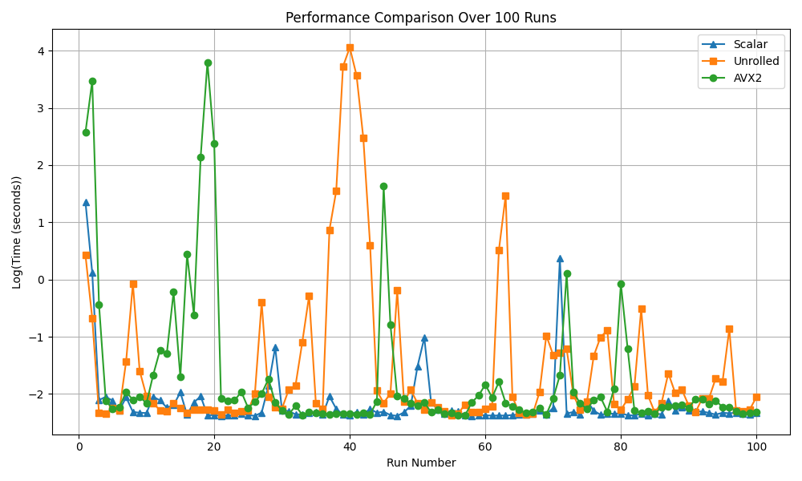

Compile:
`g++ -mavx2 -O3 -o main main.cpp`

Run:
`./main 100 && python3 plot.py`

### Performance:

### Further Considerations:
I initially assumed that the `-funroll-loops` flag would make the `Optimized` and `Scalar` versions perform similarly. However, that turned out not to be the case. The difference remains nearly the same as shown in the figure above, which is something worth exploring in the future.